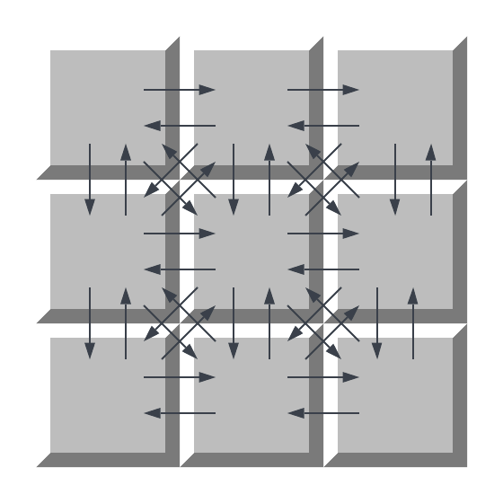
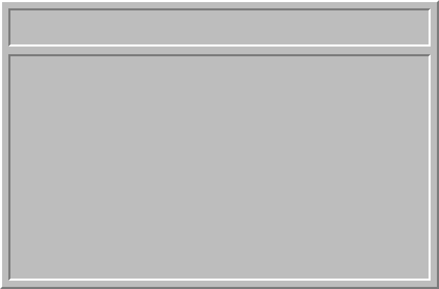
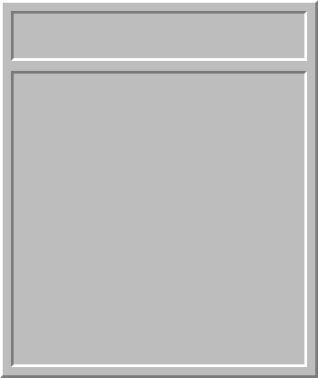
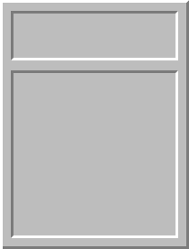

## Minesweeper CSP

Minesweeper CSP is a Java implementation of [Microsoft Minesweeper](https://en.wikipedia.org/wiki/Microsoft_Minesweeper)
using [communicating sequential processes (CSP)](https://en.wikipedia.org/wiki/Communicating_sequential_processes).

Each game tile is an independent, anonymous process and _all_ communication occurs via (buffered) channels.
No explicit synchronization primitives are used beyond channels.

It's built atop virtual threads, defined in [JDK Enhancement Proposal (JEP) 425](https://openjdk.java.net/jeps/425)
and available as a preview feature starting in Java 19.

The virtual threads feature is part of [Project Loom](https://openjdk.java.net/projects/loom/).

Prior to virtual threads, CSP-style programming in this manner simply wasn't available in Java.



# Build

An [OpenJDK 19](https://jdk.java.net/19/) or later build is required. At the time of this writing, virtual
threads are a preview feature. That is why `--enable-preview` is provided below.

---
Build with `mvn`:
```shell
mvn compile
```

Run:
```shell
java --enable-preview -cp target/classes/ minesweeper.Main
```

---
Compile with `javac`:
```shell
javac --enable-preview -source 19 src/main/java/minesweeper/*.java -d build/
```

Run:
```shell
java --enable-preview -cp build/ minesweeper.Main
```

## Command Line Arguments

Include `beginner`, `intermediate`, or `advanced` command-line argument to select a difficulty.

```shell
java --enable-preview -cp build/ minesweeper.Main advanced
```

| Difficulty   | Rows | Columns | Mines |
|--------------| ---- |---------|-------|
| Beginner     | 9    | 9       | 10    |
| Intermediate | 16   | 16      | 40    |
| Advanced     | 16   | 30      | 99    |

## Assets

All game assets were created from scratch in [Inkscape](https://inkscape.org/) and rasterized to PNG images.

         

           

  

  

## Processes

Every tile runs in its own process, defined in [Cell.java](src/main/java/minesweeper/Cell.java).
Cell processes communicate with each other via channels.

The game controller runs in its own process, defined in [Game.java](src/main/java/minesweeper/Game.java).

The window runs in its own process, defined in [Window.java](src/main/java/minesweeper/Window.java).

Finally, the clock runs in its own process, defined in [Clock.java](src/main/java/minesweeper/Clock.java).